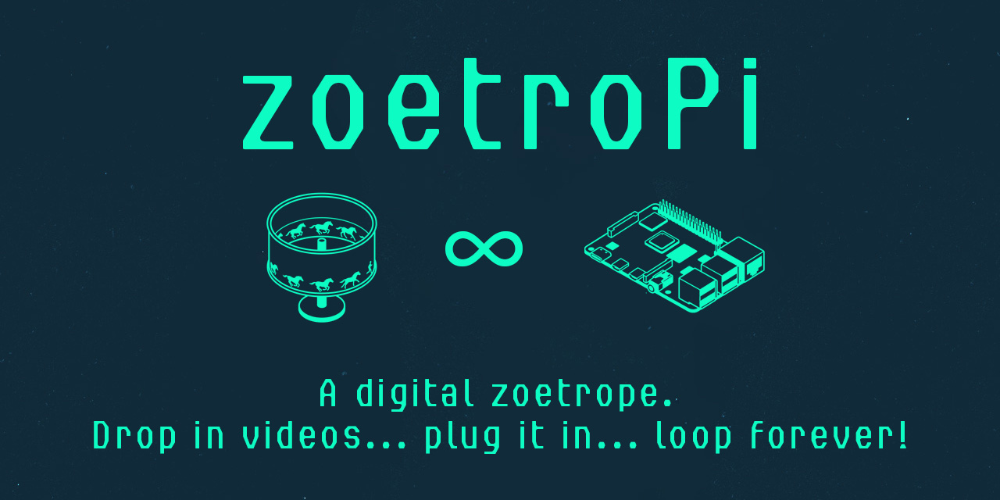

# zoetroPi



Turn a Raspberry Pi into a silent, no-UI video-loop appliance for art installations.
Drop `.mp4` files onto a USB stick, plug it in, power the Pi — the videos play
fullscreen and loop forever. No desktop, no splash, no mouse pointer, no nothing.

Tested on Raspberry Pi Zero 2 W, Pi 3, Pi 4, Pi 5 with Raspberry Pi OS Lite
(Trixie or Bookworm, 64-bit).

---

## Quick start — flash the ready-made image

1. Download the latest `zoetropi-*.img.xz` from the
   [Releases page](https://github.com/fritzgnad/zoetroPi/releases).
2. Flash it with [Raspberry Pi Imager](https://www.raspberrypi.com/software/)
   or [balenaEtcher](https://etcher.balena.io/) onto an SD card (≥ 4 GB).
3. **Add videos** — pick either method:
   - *USB stick:* format as FAT32, exFAT, or ext4, copy `.mp4`s onto it,
     plug into the Pi.
   - *SD card directly:* after flashing, the `bootfs` partition mounts on
     your Mac (as `/Volumes/bootfs`). Open the `videos/` folder inside it,
     drop your `.mp4`s, eject. No USB stick needed. Limited to ~400 MB
     total — the boot partition is small.
4. Boot the Pi with an HDMI display attached. Playback starts within a few
   seconds.

**Default credentials** (for SSH / keyboard login if you ever need them):
`pi` / `zoetropi`. SSH is disabled out of the box; to enable it, put an empty
file called `ssh` on the boot partition before first boot.

---

## Install on an existing Pi OS Lite

If you already have a Pi running Raspberry Pi OS Lite (Bookworm) and prefer not
to re-flash:

```bash
sudo apt-get update
sudo apt-get install -y git
git clone https://github.com/fritzgnad/zoetroPi.git
cd zoetroPi
sudo ./install.sh
sudo reboot
```

After reboot the Pi goes straight into video mode. With no USB stick present
the screen stays black; plug one in and playback starts.

---

## How it works

- `scripts/zoetropi-play.sh` — main loop. Mounts the first USB partition it
  finds at `/media/zoetropi` (read-only), builds a playlist of `*.mp4`,
  `*.mov`, `*.mkv`, `*.webm`, `*.m4v`, `*.avi`, and hands it to `mpv`.
- `systemd/zoetropi.service` — systemd unit that pins the player to `tty1`,
  restarts it on crash, and conflicts with `getty@tty1` so no login prompt
  ever flashes.
- `config/mpv.conf` — per-installation mpv overrides (hardware decoder,
  aspect, audio). Edit `/etc/zoetropi/mpv.conf` on a running Pi.
- `install.sh` — drops the above into place, masks the tty1 getty, and
  patches `/boot/firmware/cmdline.txt` + `config.txt` for a silent boot.
- `pi-gen/stage-zoetropi/` — custom [pi-gen](https://github.com/RPi-Distro/pi-gen)
  stage that bakes everything into a flashable `.img`.
- `.github/workflows/build-image.yml` — GitHub Actions workflow that runs
  pi-gen and attaches the resulting image to a GitHub Release on every `v*`
  tag.

### Boot sequence

```
power on → Pi firmware → kernel (quiet) → systemd →
zoetropi.service takes tty1 → mpv opens DRM plane → first frame
```

No desktop, no Wayland, no X. `mpv` draws directly to the KMS/DRM framebuffer.

---

## Video format recommendations

| Pi model       | Safe codec     | Max sensible resolution |
|----------------|----------------|--------------------------|
| Pi Zero 2 W    | H.264          | 1080p30                  |
| Pi 3 B/B+      | H.264          | 1080p30                  |
| Pi 4           | H.264 or H.265 | 1080p60 or 4K30 (H.265)  |
| Pi 5           | H.264 or H.265 | 4K60                     |

zoetroPi uses the Pi's V4L2 M2M hardware decoder (`--hwdec=v4l2m2m-copy`), so
the video format must match what the decoder supports. Use **yuv420p** pixel
format and **level 4.0** or lower for H.264 — higher profiles or 10-bit colour
will fall back to software decoding and cause stutter.

### ffmpeg encode examples

**Pi Zero 2 W / Pi 3 — H.264, 720p24** *(recommended for smoothest playback)*:

```bash
ffmpeg -i input.mov \
  -c:v libx264 -preset slow -crf 22 \
  -vf "scale=1280:720,fps=24" \
  -pix_fmt yuv420p \
  -profile:v high -level:v 3.1 \
  -b:v 4M -maxrate 5M -bufsize 8M \
  -movflags +faststart \
  -c:a aac -b:a 128k \
  output.mp4
```

If you need 1080p on a Pi 3, keep it at 30 fps and cap the bitrate:

```bash
ffmpeg -i input.mov \
  -c:v libx264 -preset slow -crf 22 \
  -vf "scale=1920:1080,fps=30" \
  -pix_fmt yuv420p \
  -profile:v high -level:v 4.0 \
  -b:v 8M -maxrate 10M -bufsize 16M \
  -movflags +faststart \
  -c:a aac -b:a 128k \
  output.mp4
```

> **Pi 3 GPU tip:** the Pi 3's VideoCore IV pays extra overhead when mpv uses
> the `gpu` renderer. For smoother playback, SSH into the Pi and add
> `vo=drm` to `/etc/zoetropi/mpv.conf` — this writes directly to the
> framebuffer without GPU compositing. Trade-off: no GPU scaling, so the
> video resolution must match the display's native resolution exactly.

**Pi 4 — H.264, 1080p60:**

```bash
ffmpeg -i input.mov \
  -c:v libx264 -preset slow -crf 20 \
  -vf "scale=1920:1080,fps=60" \
  -pix_fmt yuv420p \
  -profile:v high -level:v 4.2 \
  -movflags +faststart \
  -c:a aac -b:a 128k \
  output.mp4
```

**Pi 4 / Pi 5 — H.265 (HEVC), 4K30:**

```bash
ffmpeg -i input.mov \
  -c:v libx265 -preset slow -crf 22 \
  -vf "scale=3840:2160,fps=30" \
  -pix_fmt yuv420p \
  -tag:v hvc1 \
  -movflags +faststart \
  -c:a aac -b:a 128k \
  output.mp4
```

> **Tip — silent loop:** drop `-c:a` and add `-an` to strip audio entirely.
> For gapless playlist transitions, all clips must share the same resolution,
> frame rate, and codec — mpv can't seamlessly cross between differently shaped
> streams. For a single-clip loop this doesn't matter.

---

## Customising

- **Kill audio entirely:** uncomment `ao=null` in `/etc/zoetropi/mpv.conf`.
- **Force a specific decoder:** set `hwdec=v4l2m2m-copy` (or `drm`) in the
  same file.
- **Rotate the display:** add `display_hdmi_rotate=1` (90°), `2` (180°), or
  `3` (270°) to `/boot/firmware/config.txt`.
- **Ship videos inside the image:** drop `.mp4` files into
  `pi-gen/stage-zoetropi/00-install/files/` and copy them into
  `/opt/zoetropi/videos/` from `00-run.sh` — the player falls back to that
  directory when no USB is present.

---

## Troubleshooting

```bash
# follow the player logs
sudo journalctl -u zoetropi -f

# run the player interactively to see mpv errors
sudo systemctl stop zoetropi
sudo /usr/local/bin/zoetropi-play.sh
```

If `mpv` complains about `gpu-context=drm`, try editing
`/etc/zoetropi/mpv.conf` and adding `vo=drm`. On very old firmware you may
need to switch from the KMS driver to the legacy `fake_kms` driver in
`/boot/firmware/config.txt` — but on current Pi OS Bookworm KMS is the
default and works on all supported Pi models.

---

## Building the image yourself

See [docs/BUILDING.md](docs/BUILDING.md).

---

## License

MIT. Do whatever — attribution appreciated. Built by
[Fritz Gnad](https://github.com/fritzgnad) for the zoetrope / installation-art
crowd.
